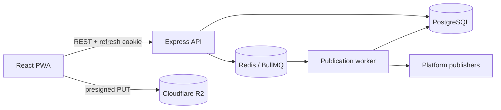

# Architecture

## Current architecture

VideoFlow — pnpm-монорепозиторий и модульный монолит с отдельным worker. Ниже
описано фактическое состояние, а не желаемая структура.



PostgreSQL хранит доменное состояние. BullMQ хранит delayed execution jobs, но
не является источником истины о публикации.

## Backend boundaries

```text
api/routes       HTTP validation, authentication and response mapping
services/auth    registration, login, refresh rotation and sessions
services/oauth   provider OAuth and encrypted platform accounts
services/upload  R2 presign and upload completion checks
services/publications  persistence, scheduling, status aggregation and retry
platforms        official platform adapters when implemented
workers          queue consumption and delegation to application services
db               shared Prisma client and connection checks
config           validated environment and domain constants
```

Фактическое направление зависимостей:

- routes вызывают services и не используют Prisma напрямую;
- services содержат бизнес-логику и сейчас используют общий Prisma client;
- publication service оркестрирует queue и platform publisher;
- worker получает ID и делегирует обработку publication service;
- platform credentials расшифровываются только внутри backend;
- platform adapter не должен напрямую менять Publication.

Repository-слой сейчас отсутствует. Не добавлять его частично в обычной фиче и
не описывать как существующий; такое изменение требует отдельного refactoring
TASK/ADR.

## Frontend boundaries

```text
pages       route-level composition and user flows
api         HTTP contracts, Axios client and session bridge
store       client authentication state
components  reusable UI and layout primitives
routes      routing and protected navigation
lib         generic local utilities
```

- pages используют `api`, `store` и `components`;
- remote state загружается через TanStack Query;
- access token живёт только в памяти;
- refresh token хранится в httpOnly cookie;
- pure transformations формы и отображения выносятся в view-model modules;
- новые raw HTTP-вызовы вне `frontend/src/api` запрещены.

## Publication flow

1. PWA запрашивает presigned upload URL.
2. Браузер загружает видео напрямую в R2.
3. API проверяет принадлежность object key и существование объекта.
4. Publication сохраняется в PostgreSQL.
5. API создаёт delayed BullMQ job.
6. Worker загружает актуальную Publication, обрабатывает enabled platforms
   параллельно и сохраняет отдельные results.
7. Общий status агрегируется в `published`, `partial` или `failed`.

Текущий flow не поддерживает настоящий draft, reschedule, reconciliation или
реальный P0 publisher; эти ограничения перечислены в
[LEGACY_WARNINGS](LEGACY_WARNINGS.md).

## Security boundaries

- OAuth/client secrets не передаются frontend;
- platform access/refresh tokens хранятся только зашифрованными;
- jobs содержат идентификаторы, а не secrets;
- auth endpoints ограничены rate limiter;
- frontend и backend обмениваются refresh cookie только с корректными
  `secure`/`sameSite` настройками;
- request logs и persisted metadata не должны содержать OAuth code/state/token;
- raw provider payload сохраняется только после allowlist/redaction.

Текущее нарушение последнего правила является блокером
[TASK-001](tasks/TASK-001-security-baseline.md).

## Target evolution

Целевая доменная эволюция выполняется короткими задачами без одномоментного
переноса каталогов:

- отделить MediaAsset lifecycle от Publication;
- заменить JSONB targets типизированными PublicationTarget;
- сделать `scheduledAt` optional для draft;
- добавить versioned schedule jobs, automatic retry и reconciliation;
- добавить analytics, Web Push и retention workers;
- подключать platform adapters только после официального gate.

Microservices, workspace boundary, billing и native client не входят в scope.

## Rules for new code

- Сначала переиспользовать существующий сервис или primitive.
- Бизнес-ветвления не размещать в route handler или worker entrypoint.
- Внешний provider изолировать за типизированным adapter contract.
- Ошибка одной платформы не должна отменять успешные результаты других.
- Миграции создаются отдельно, reviewable и совместимо с существующими данными.
- Архитектурный рефакторинг не смешивается с продуктовой фичей без явного scope.
