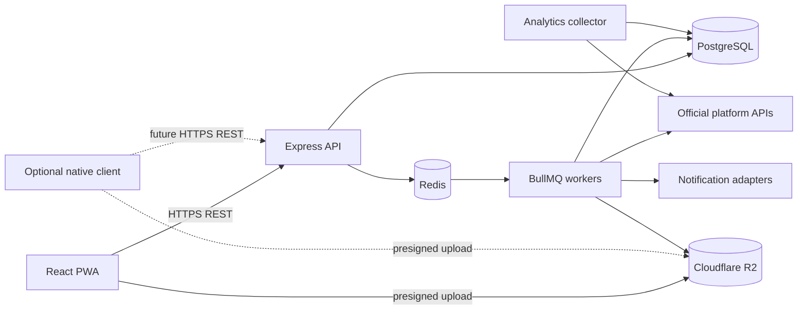
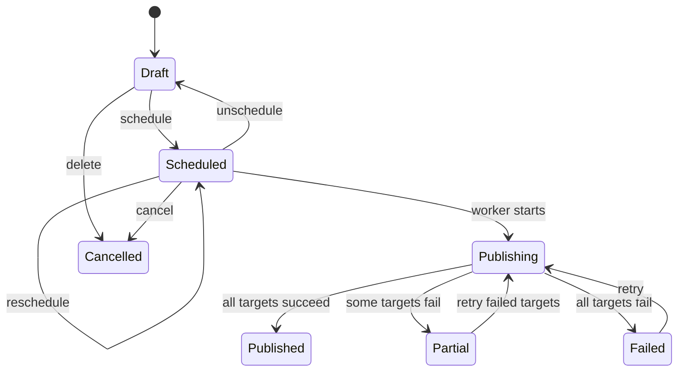

# VideoFlow Target Architecture

**Версия:** 2.0
**Статус:** целевая архитектура для следующих этапов

## 1. Архитектурные цели

- быстро развивать PWA без переписывания существующего backend;
- выполнять публикации независимо от клиентского устройства;
- изолировать нестабильные социальные API;
- сохранить простой deployment для небольшой команды;
- подготовить данные и границы доступа к multi-tenant SaaS;
- оставить возможность добавить native iOS client.

## 2. Архитектурный стиль

VideoFlow развивается как **модульный монолит с отдельным worker-процессом**.
Платформенные интеграции строятся по принципу Ports & Adapters.

Микросервисы не вводятся до появления подтверждённой причины: отдельного
масштабирования, независимой команды или специальных runtime-требований.



## 3. Модули backend

```text
backend/src/
  modules/
    identity/        users, sessions, OAuth login
    workspaces/      personal/organization ownership and membership
    accounts/        social accounts, token lifecycle, capabilities
    media/           uploads, validation, covers, retention
    publications/    drafts, scheduling, status aggregation
    publishing/      orchestration, retries, idempotency
    analytics/       metric polling and snapshots
    notifications/   in-app, Web Push, email adapters
    billing/         future plans, entitlements, usage
  platforms/
    instagram/
    tiktok/
    youtube/
    vk/
    pinterest/
  shared/
    config/
    db/
    queue/
    security/
    observability/
```

Это целевая структура, а не требование одномоментно переместить существующие
файлы. Рефакторинг выполняется по мере добавления функций.

Модули взаимодействуют через публичные application interfaces. Platform
adapters не должны изменять Publications напрямую.

## 4. Доменная модель

### Workspace

Граница владения и tenant isolation.

- `PERSONAL` создаётся автоматически для пользователя;
- `ORGANIZATION` добавляется на SaaS-этапе;
- publication, media, account и usage принадлежат workspace;
- каждый запрос проверяет membership и permission.

### PlatformAccount

- workspace;
- platform;
- external identity;
- encrypted access/refresh token;
- expires/refresh metadata;
- connection status;
- granted scopes;
- capability snapshot;
- один активный account на platform для базового тарифа.

### MediaAsset

- workspace и owner;
- object key, MIME, size;
- duration, width, height и validation state;
- upload lifecycle;
- retention deadline и deletion state;
- производные assets и covers.

### Publication

- workspace;
- optional media для локального незагруженного draft на client side;
- status и version;
- optional `scheduledAt`;
- display timezone;
- platform targets;
- lifecycle timestamps.

### PublicationTarget

Предпочтительная эволюция текущего JSONB `platforms`.

- publication + platform;
- enabled;
- platform-specific text/title/settings;
- cover asset;
- publish status;
- retry state;
- external ID и URL;
- normalized error.

JSONB допустим для быстро меняющихся settings, но queryable status, ownership и
result должны оставаться типизированными колонками.

### MetricSnapshot

- publication target;
- platform timestamp;
- views, likes, comments, shares, saves как nullable;
- raw redacted payload;
- unsupported fields не превращаются в нули.

### NotificationEndpoint

- user;
- channel;
- Web Push subscription или future native device token;
- enabled/invalidated timestamps.

### Plan, Subscription и UsageRecord

Добавляются после creator MVP, но entitlement checks проектируются как отдельный
application port, а не распределяются по route handlers.

## 5. Publication lifecycle



`Cancelled` может быть отдельным статусом или soft-delete состоянием. Решение
фиксируется до миграции schema.

## 6. Scheduling и idempotency

PostgreSQL — источник истины. BullMQ содержит исполняемую проекцию расписания.

- job ID детерминирован publication ID и version;
- schedule/reschedule выполняются с компенсацией при ошибке queue;
- worker проверяет актуальную version и status перед внешним вызовом;
- lock не позволяет двум worker одновременно публиковать один target;
- внешний request получает idempotency key, если API его поддерживает;
- retry повторяет только transient failure и только failed target;
- неизвестный результат после timeout сначала reconciliation, затем retry.

Публикации разных платформ могут выполняться параллельно с ограничением
concurrency и platform rate limits.

## 7. Platform ports

Минимальный контракт adapter:

```ts
interface PublishingProvider {
  platform: Platform;
  getCapabilities(account: ConnectedAccount): Promise<Capabilities>;
  validate(input: PublishInput): Promise<ValidationResult>;
  publish(input: PublishInput): Promise<PublishResult>;
  reconcile(input: ReconcileInput): Promise<PublishResult | null>;
  fetchMetrics(input: MetricsInput): Promise<MetricSnapshot>;
  refreshCredentials?(account: ConnectedAccount): Promise<RefreshedCredentials>;
}
```

Контракт концептуальный. Типы уточняются при реализации.

Capabilities описывают:

- допустимые форматы и размеры;
- title/description/privacy fields;
- cover support;
- direct upload или pull-from-URL;
- metric support;
- token refresh;
- quotas и ограничения аккаунта.

Frontend получает capabilities от backend и не кодирует предположения о
платформе в нескольких местах.

## 8. Клиентская архитектура

PWA остаётся API-клиентом и не содержит publishing credentials.

- server state: TanStack Query;
- краткоживущий access token: memory;
- refresh session: secure httpOnly cookie;
- offline metadata: IndexedDB;
- queued local commands имеют client-generated idempotency key;
- service worker кэширует versioned application shell;
- install и push считаются progressive enhancement.

Native iOS client в будущем использует тот же REST contract. В Keychain хранится
только сессия VideoFlow, social tokens остаются на backend.

## 9. Notifications

`NotificationService` принимает доменное событие и выбирает адаптер:

- in-app notification;
- Web Push;
- email;
- future APNs.

Ошибка уведомления не меняет результат publication. Invalid push subscriptions
деактивируются. События дедуплицируются.

## 10. Analytics

Отдельный scheduler выбирает targets, которым пора обновить метрики.

- частота зависит от возраста публикации, тарифа и quota;
- provider возвращает только поддерживаемые поля;
- snapshots сохраняются пакетно;
- latest metrics могут денормализоваться для быстрого history UI;
- ошибки analytics не меняют publish status.

## 11. Retention

- после завершения публикации рассчитывается `deleteAfter`;
- retention worker удаляет R2 object и фиксирует результат;
- legal hold или тариф может продлить срок;
- повторная операция безопасна;
- metadata, result URLs и analytics сохраняются;
- удаление workspace имеет отдельный полный deletion workflow.

## 12. Security boundaries

- social tokens никогда не возвращаются клиенту;
- secrets исключаются из logs, error payloads и raw metadata;
- encryption keys отделены от базы;
- OAuth state подписан, одноразов и короткоживущ;
- redirect URLs фиксированы;
- tenant scope обязателен в repository/application operations;
- background jobs содержат IDs, а не токены;
- platform responses редактируются перед persistence;
- audit events создаются для connect, reconnect, disconnect и token refresh.

## 13. Deployment evolution

### Creator MVP

- один frontend deployment;
- один API process;
- один или несколько worker processes;
- PostgreSQL, Redis, R2;
- HTTPS reverse proxy.

### SaaS

- stateless API horizontal scaling;
- worker queues/concurrency по платформе;
- managed PostgreSQL/Redis при необходимости;
- object lifecycle rules;
- centralized logs, metrics, traces and alerts;
- backup/restore drills.

Выделение platform worker в отдельный deploy допустимо без превращения всего
backend в микросервисы.

## 14. Переход от текущего состояния

1. Закрыть известные OAuth leaks в metadata и request logs.
2. Зафиксировать текущий VK-код как исторический platform adapter.
3. Ввести capability contract.
4. Добавить workspace boundary без изменения пользовательского UX.
5. Разделить media и publication lifecycle.
6. Реализовать drafts/reschedule.
7. Подключать платформы только после feasibility gates.
8. Добавить notifications, retention и analytics.
9. После подтверждения продукта включать SaaS-модули.
