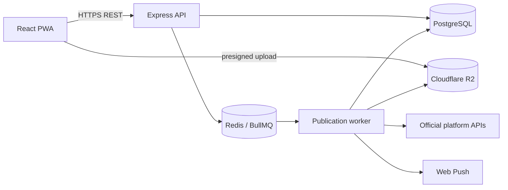

# VideoFlow Architecture

## 1. Стиль

VideoFlow — модульный монолит с отдельным worker-процессом. PWA отвечает за
подготовку контента и управление расписанием; публикация всегда выполняется на
сервере.



PostgreSQL — источник истины. BullMQ содержит исполняемую проекцию расписания.

## 2. Backend boundaries

```text
identity/        users, sessions, Sign in with Apple
accounts/        OAuth accounts, encrypted tokens, token health
media/           upload, validation, covers, seven-day retention
publications/    drafts, targets, scheduling and history
publishing/      queue, retries, idempotency and reconciliation
analytics/       metric polling and snapshots
notifications/   in-app status and Web Push
platforms/       instagram, tiktok, youtube; later vk and pinterest
```

Платформенные адаптеры работают только с официальными API и не изменяют
Publication напрямую.

## 3. Доменная модель

- `User` — единственный владелец данных первой версии;
- `PlatformAccount` — один аккаунт платформы, encrypted access/refresh tokens;
- `MediaAsset` — R2 object, MIME, размер, duration, dimensions и retention;
- `Publication` — draft или запланированный мульти-пост;
- `PublicationTarget` — описание, обложка, настройки и результат платформы;
- `MetricSnapshot` — nullable views, likes и saves;
- `PushSubscription` — Web Push endpoint установленной PWA.

Workspace, organization, billing и entitlement сущности не входят в scope.

## 4. Scheduling и publishing

- время вводится в `Europe/Moscow` и сохраняется как UTC instant;
- job ID зависит от publication ID и version;
- worker проверяет актуальные version и status;
- платформы выполняются независимо и параллельно;
- transient failure повторяется не более трёх раз с backoff;
- permanent failure не повторяется автоматически;
- неизвестный результат сначала проходит reconciliation;
- результат содержит external ID, URL, status и нормализованную ошибку.

## 5. PWA

- server state: TanStack Query;
- access token: memory;
- refresh session: secure httpOnly cookie;
- offline drafts и последний календарь: IndexedDB;
- application shell: Service Worker;
- Web Push доступен установленной PWA на поддерживаемых версиях iOS.

Социальные токены никогда не передаются PWA.

## 6. Security

- HTTPS only вне локальной разработки;
- OAuth state подписан и короткоживущ;
- platform tokens зашифрованы отдельным ключом;
- secrets удаляются из логов, metadata и error payloads;
- background jobs содержат ID, а не токены;
- внешние ответы редактируются перед сохранением;
- auth и чувствительные endpoints защищены rate limiting.

## 7. Deployment

- один frontend deployment;
- один API process;
- один или несколько worker processes;
- PostgreSQL, Redis и Cloudflare R2;
- HTTPS reverse proxy;
- structured logs, queue metrics, backups and alerts.
